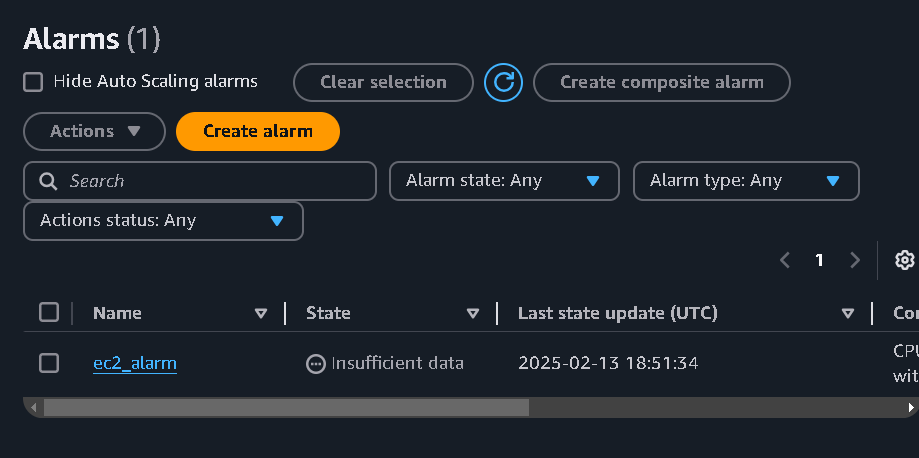
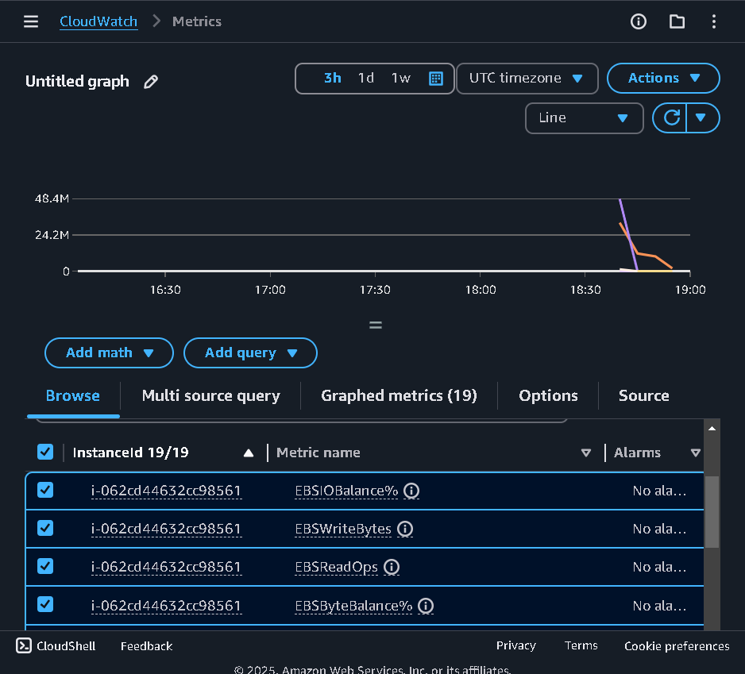
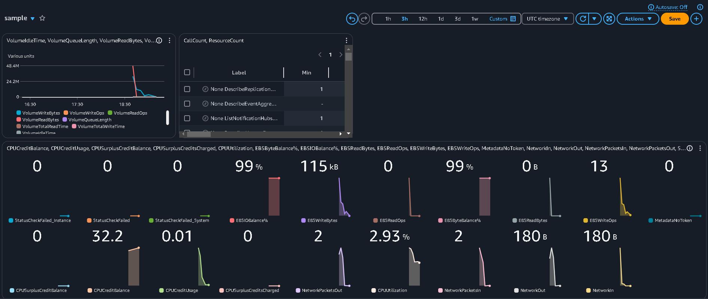

# CLOUD_MONITORING_ALERTS

**COMPANY**: CODTECH IT SOLUTIONS 

**NAME**: M.S.G.N. SURYA VAIBHAV

**INTERN ID**: CT08IVH

**DOMAIN**: CLOUD COMPUTING

**BATCH DURATION**: JANUARY 20, 2025 to FEBRURAY 20, 2025

**MENTOR NAME**: NEELA SANTOSH

## TASK: 
SET UP MONITORING FOR A CLOUDBASED APPLICATION USING AWS
CLOUDWATCH.

## Description :
In This task i need to deploy an cloud based application or and web application connected to multiple services provided by the CSP (AWS)

## procedure:
1. Create an EC2 instance :
   - Create an basic instance of an aws amazon linux
   - select the amazon linux ami
   - select t2 micro for the basic web applications or applications
   - select an key pair
   - configure the networ settings
   - allow http trafic as it is an web application
   - go to advance settings
   - get to user data - optional and add the code for the instance
   - [user data](user_data)
   - create the instance
2. For alarms :
   - go to the cloud watch -> alarms -> create alarm
   - enter the conditions for the alarms
   - enter the threshold  value
   - next -> ec2 actions -> stop this instance
   - this will stop this instance when the threshold value is hit
   - next -> review and create -> create alarm
   
   
3. For Monitoring :
   - for monitoring an application if we have deployed multiple instances and have multiple services assoated with them we use cloud watch metrics
   - we can access metrics of all services
   - for the launched instances now go to EC2
   -  metrics -> EC2 -> pre instance metrics
   -  select the metrics you need to monitor like Ebs write , network out , network in
   -  we could able to see the graph for the selected metrics

    
4. Dashboards:
   - The dashboards are part of the Cloudwatch
   - These are used for create an dashboard that contains all the information that is assosated with your applications
   - These are centerlized monitoring for all your application
   - To create an dashboard navigate to cloud watch
   - Dashboards -> create an dashboard
   - Give an name to the dashboard
   - select data source type (Cloud watch) , data type (metrics) , widget type (any)
   - select the type of services you want to monitor like EC2,EBS,SNS
   - I am creating an dashboard for some types for types EC2 -> pre-instance metrics -> select the metrics to be monitoring
   - This will make an centrelized place to monitor the application
  
   
     
     
## Theory : 
### EC2 : 

The Amazon Web Services (AWS) Cloud, Amazon Elastic Compute Cloud (Amazon EC2) offers scalable, on-demand processing power. Because Amazon EC2 lowers hardware expenses, you can create and launch apps more quickly. With Amazon EC2, you can set up networking and security, control storage, and launch as many or as few virtual servers as you require. To manage compute-intensive jobs, including monthly or annual procedures or surges in website traffic, you can scale up (increase capacity). You can scale down (lower capacity) if usage starts to decline. A virtual server in the AWS Cloud is called an EC2 instance. The hardware that is available to your instance depends on the instance type you pick when you launch an EC2 instance.

 

### Amazon CloudWatch : 

Real-time monitoring of your Amazon Web Services (AWS) resources and applications is provided via Amazon CloudWatch. Metrics are variables you can measure for your apps and resources, and CloudWatch can be used to gather and monitor them.Every AWS service you use has metrics automatically displayed on the CloudWatch home page. Additionally, you may design your own dashboards to show analytics about your own apps as well as bespoke sets of metrics of your choosing.

### Dashboard :

You may utilize Amazon CloudWatch dashboards, which are customizable home pages in the CloudWatch console, to keep an eye on all of your resources—even those located in various regions—in one place. Customized views of the metrics and alarms for your AWS resources can be created with CloudWatch dashboards.

With dashboards, you can create the following:
- A single view for selected metrics and alarms to help you assess the health of your resources and applications across one or more Regions. 
- You can select the color used for each metric on each graph, so that you can easily track the same metric across multiple graphs.
- An operational playbook that provides guidance for team members during operational events about how to respond to specific incidents.
- A common view of critical resource and application measurements that can be shared by team members for faster communication flow during operational events.
